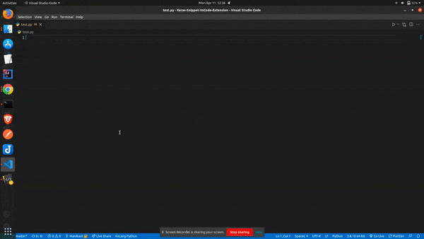

# Keras Snippet

> This is a keras code snippet extension that provide boilerplate for different CNN algorithm and the as well as for
> various element involved at the time of writing deep learning code from scratch.
>This snippet reduces the coding time

## Features
 

| Prefix          |  Description      |
| --------------- | ---------------- |
| `!impt`         | `This will import important different Library of CNN`|
| `!cnn`          | `This prefix will import a CNN layer boilerplate that you can change according to your need `|
| `!cnn-pred`     | `This prefix will create a model prediction code boilerplate after training of model` |
| `!inception-v3` | `This prefix will create a IceptionV3 transfer learning model boilerplate`  |
| `!vgg16`        | `This prefix will create a VGG16 transfer learning model boilerplate`    |
| `!vgg19`        | `This prefix will create a VGG19 transfer learning model boilerplate`    |
| `!resnet-50`    | `This prefix will create a ResNet50 transfer learning model boilerplate`                   |
| `!xception`     | `This prefix will create a ExceptionNet transfer learning model boilerplate`   |
| `!mnist-clas`   | `This prefix will create a MNIST digit classifier from scratch`  |
| `!adam`, `!adadelta`, `!sgd`, `!rms`, `!adagrad`| `These prefix will create a code snippet for different optimizer`  |
| `!relu`, `!softmax`, `!tanh`, `!softsign`, `!sigmoid` |`These prefix will create a code snippet for different activation functions` |
| `!mnist`, `!cifar10`, `!imdb`, `!boston` | `These prefix will create a code snippet for how to load different datasets` |

 
## Requirements
- `Tensorflow` and `Keras` should be installed

**Enjoy!**
